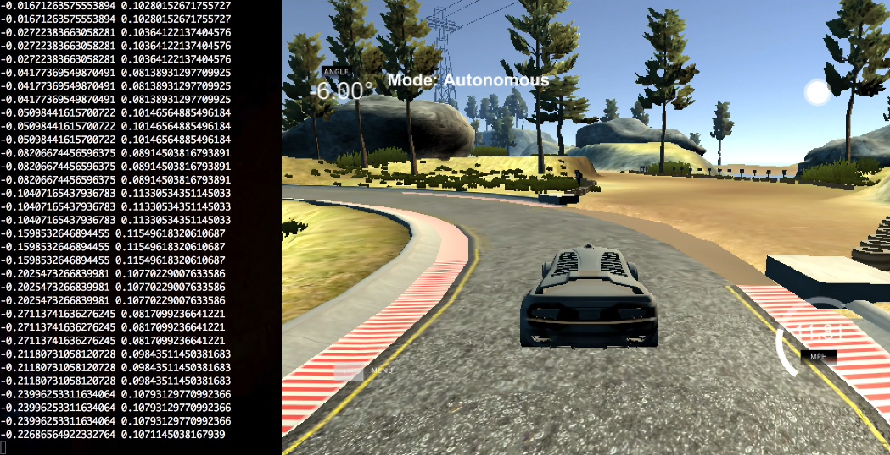

# Teaching a Car to Drive Itself with Behavioral Cloning
<figure>
  
</figure>
 

Can we teach a car to drive itself with only pixel information from images taken by a camera on the car's hood and a Deep Convolutional Neural Network? Remarkably, the answers is yes. At least, it seems we can, even in some of the most difficult situations like on mountain roads with switchbacks, when we ignore some of the difficult problems posed by traffic and pedestrians.

The contents of this repository include two videos track1.mp4 and track2.mp4 taken from the hood of the car in Udacity's simulation, while the car drives itself around each track. The model used to drive the car can be recreated using model.py, and my results are saved in model.h5. If you have the simulation, you can test my results with drive.py and turn the frame images into a mp4 with video.py. 

Below is a step-by-step at how/why I came up with model.py. Enjoy :)

### 1) Collect data
Using the simulator provided by Udacity, I recorded myself driving until I collected about 25,000 frame images from the car's center camera for both tracks. I drove around the tracks clockwise and counter-clockwise to help the model generalize. I tried to keep the steering as smooth as possible and tried to keep the car in the center of the lane. Because the lanes in track 2 are so narrow and the turns so sharp, I essentially ignored the center dotted line as though I had the road to myself.

### 2) Attach data to Amazon Web Services instance
To upload the data, launch a p2.xlarge instance with Bitfusion Ubuntu 14 TensorFlow Amazon Machine Image, adding as much storage as necessary to handle the data. I recorded track 1 and track 2 separately, so if you want to use my code, you'll have to do the same. 
Upload track 1 data with:
> scp -r -i /path/to/your/key-pair.pem /path/to/track1/data ubuntu@<your instance's Public DNS>:~/data/car_sim_data_more

Upload track 2 data with:
> scp -r -i /path/to/your/key-pair.pem /path/to/track2/data ubuntu@<your instance's Public DNS>:~/data/car_sim_data_track2_more

I recorded one loop of smooth driving around track 1 to act as the test set. Upload that with:
> scp -r -i /path/to/your/key-pair.pem /path/to/test/data ubuntu@<your instance's Public DNS>:~/data/car_sim_data_test
 
### 3) Augment training data by a factor of 8
After cropping the images to get rid of as much extraneous information as possible, I used three techniques to augment the data. This allowed me to only capture videos of ideal driving, while allowing the model to learn how to correct itself in case it over-turned or under-turned or veered off-center.

The data from the simulator includes a driving log with the filename of a frame image along with that frame's steering angle, throttle, break, and current speed. There are three camera's, one on the hood's center, one on the left edge of the hood, and another on the right. The validation and test sets only inlclude the center image. For the train set, left and right images are also used. If the car's steering angle is negative, i.e. it's currently turning left, take the right image and subtract 0.2. If the angle is positive, take the left image and add 0.2. If the steering angle is 0, take both right and left images and subtract and add 0.2 respectively. See the 'get_RL_angles' function in model.py (line 10).
<figure>
  
</figure>
 

 
 
When using the 'get_batches' function (line 133) as the training data generator, after reading a batch of images, which may include some left camera and right camera images with adjusted angles, flip each image and multiply the steering angle by -1.
<figure>
  
</figure>
 

 

After flipping the images, if the steering angle is negative, use the 'warp_persp' function (line 31) to warp images by a random factor so it seems the car is facing farther to the right and decrease angle accordingly. Here's an example of the 'warp_persp' function applied to the cropped images:
<figure>
  
</figure>
 

 
 
 Do the opposite if the steering angle is positive.
 <figure>
  
</figure>
 

 

### 4) Build the network
I used the following archithecture, adding two Batch Normalization layers to increase the speed of convergence and three Dropout layers with a drop rate of 0.5 to combat overfitting.

| Layer     | Description | 
|:--------------:|:-------------:| 
| Input      | images in the shape [batch size, 40, 160, 3] | 
| Normalize      | normalize pixel values between 0 and 1 with Lambda function| 
| Conv1    | filter=5x5, stride=1, num_layers=64| 
| ReLU1 | leaky ReLU, alpha=0.2 |  
| Conv2      | filter=5x5, stride=2, num_layers=64| 
| BatchNorm2  | batch normalization | 
| Drop2 | dropout |  
| ReLU2    | leaky ReLU, alpha=0.2  | 
| Conv3      | filter=5x5, stride=1, num_layers=64| 
| ReLU3    | leaky ReLU, alpha=0.2  | 
| Conv4     | filter=5x5, stride=2, num_layers=64|
| BatchNorm4  | batch normalization | 
| Drop4 | dropout |  
| ReLU4    | Leaky ReLU, alpha=0.2  | 
| Conv5     | filter=3x3, stride=1, num_layers=64| 
| ReLU5    | leaky ReLU, alpha=0.2  | 
| Conv6     | filter=3x3, stride=2, num_layers=64| 
| ReLU6    | leaky ReLU, alpha=0.2  | 
| FC7   | fully-connected, num_units=512  |
| ReLU7    | leaky ReLU, alpha=0.2  | 
| Drop7 | dropout |
| FC8   | fully-connected, num_units=512  |
| ReLU8    | leaky ReLU, alpha=0.2  | 
| Out   | fully-connected, num_units=1  |

I trained the model for 2 epochs with the Adam optimizer and Mean Absolute Error cost function. I used a batch size of 16, but since the latter two data augmentation techniques occur within the train generator, the batch size is essentially 64.

Here's a screen shot of the car navigating track 2:
<figure>
  
</figure>
 

 
